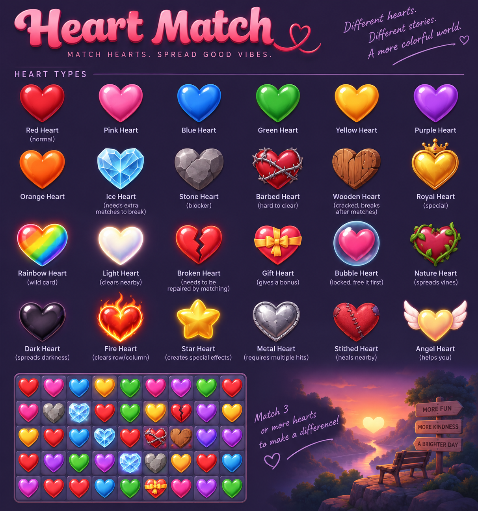

# 💕 Heart Match

> **"Match Hearts. Spread Good Vibes."**  
> *Different hearts. Different stories. A more colorful world. ♡*



[](https://kotlinlang.org/)
[-3DDC84.svg?logo=android&logoColor=white)](https://developer.android.com)
[](https://developer.android.com/jetpack/compose)
[](https://m3.material.io/)
[]()
[]()

---

## 🌟 Overview

**Heart Match** is an enchanting, feature-rich match-3 puzzle adventure game built natively for Android using **Jetpack Compose**, **Kotlin Coroutines**, and **Clean Architecture**.

Embark on a heartfelt journey across 100 handcrafted levels spread over 5 mystical worlds. Match vibrant candy hearts, trigger radiant cascades, shatter frosty and stone barriers, heal broken hearts, unleash cosmic special hearts, and spread good vibes!

---

## 💖 Heart & Tile Catalog

Heart Match features a diverse universe of hearts, obstacles, special power tiles, and blockers:

```
+-----------------------------------------------------------------------------------+
|                                 HEART TYPES                                       |
+-----------------------------------------------------------------------------------+
|  [❤️ Red]     [💗 Pink]     [💙 Blue]    [💚 Green]   [💛 Yellow]  [💜 Purple]  [🧡 Orange] |
|   Normal        Normal       Normal       Normal       Normal       Normal       Normal   |
+-----------------------------------------------------------------------------------+
|  [🧊 Ice]          [🪨 Stone]         [🪵 Wood]         [🩸 Barbed]      [👑 Royal]      |
|  Needs matches    Solid blocker      Cracked, breaks   Thorns lock tile  Crowned jewel  |
+-----------------------------------------------------------------------------------+
|  [🌈 Rainbow]      [✨ Light]         [💔 Broken]       [🎁 Gift]        [🫧 Bubble]     |
|  Wild card blast  Clears nearby      Repair by match   Gives bonus       Free to unlock |
+-----------------------------------------------------------------------------------+
|  [🌿 Nature]       [🖤 Dark]          [🔥 Fire]         [⭐ Star]        [🛡️ Metal]      |
|  Spreads vines    Void corruption    Clears row/col    Special sparkle   Multiple hits  |
+-----------------------------------------------------------------------------------+
|  [🧵 Stitched]     [🪽 Angel]                                                             |
|  Heals nearby     Blesses moves                                                   |
+-----------------------------------------------------------------------------------+
```

### 🎨 Normal Hearts
* **Red Heart**: Classic sweet crimson candy heart.
* **Pink Heart**: Romantic rose heart with dazzling shimmer.
* **Blue Heart**: Cool sapphire heart radiant with serene energy.
* **Green Heart**: Fresh emerald heart bursting with vibrant life.
* **Yellow Heart**: Sunny golden heart radiating warmth and optimism.
* **Purple Heart**: Majestic amethyst heart with royal charm.
* **Orange Heart**: Zesty amber heart brimming with playful enthusiasm.

### ⚡ Special Hearts & Combinations
Created by forming tactical match configurations:
* **🔥 Fire Heart *(Match 4 in a line)***: Blasts a searing beam that vaporizes an entire horizontal row or vertical column.
* **💣 Bomb Heart *(Match 5 in T or L shape)***: Triggers a high-impact 3x3 explosive radius that shatters obstacles and clears adjacent tiles.
* **🌈 Rainbow Heart *(Match 5 in a straight line)***: Universal wild card. Swap with any color heart to annihilate every heart of that color from the board!
* **👑 Royal Heart**: Crowned regal gem that releases cross and diamond pattern blasts.
* **🎁 Gift Heart**: Festive present tile that bestows bonus score points and fulfills gift collection goals.
* **✨ Light Heart**: Luminous holy crystal that clears all nearby tiles in a soft halo.
* **⭐ Star Heart**: Triggers cascading celestial bursts and score multipliers.
* **🪽 Angel Heart**: Winged guardian that assists the player by blessing objectives and clearing problem tiles.

#### ✨ Special Heart Combos
Swap two special hearts together for devastating board-clearing synergies:
* **Rainbow + Rainbow**: Total board wipe!
* **Rainbow + Fire**: Converts all hearts of the swapped color into Fire Hearts and detonates them simultaneously.
* **Rainbow + Bomb**: Converts all hearts of the swapped color into Bomb Hearts and triggers mass detonations.
* **Fire + Fire**: Creates a dual-axis cross laser clearing both the entire row and column.
* **Fire + Bomb**: Launches a 3-lane wide hyper-beam horizontally and vertically.
* **Bomb + Bomb**: Generates a massive 5x5 mega-explosion.

### 🛡️ Blockers & Obstacles
* **🪨 Stone Heart**: Solid rock barrier. Immovable; damaged and destroyed by adjacent matches and explosions.
* **🧊 Ice Heart**: Frosty crystalline casing trapping a normal heart inside. Cracked by matching the enclosed heart's color or adjacent hits.
* **🪵 Wooden Heart**: Multi-layered wooden crate. Each adjacent match breaks away a layer until destroyed.
* **🩸 Barbed Heart**: Thorny vine-wrapped heart. Locked in place until freed with neighboring matches.
* **💔 Broken Heart**: Fractured romantic heart piece. Movable and matchable; requires 2 repair matches to restore into a full heart.
* **🧵 Stitched Heart**: Patchwork stitched heart that heals nearby pieces when repaired through matches.
* **⛓️ Chained Heart / Bubble**: Trapped tile fixed to its board coordinate until the lock is broken.
* **🖤 Dark Heart**: Spreading corruption! Spreads dark tiles to neighboring cells each turn if left undamaged.
* **🛡️ Metal Heart**: Heavy armored plate requiring multiple consecutive direct hits.
* **🌿 Nature Heart**: Overgrown floral tile that spreads vines across nearby empty cells.

---

## 🗺️ World Map & Levels

Embark through **100 handcrafted levels** divided across 5 unique thematic realms:

| Realm | Levels | Theme Description | Palette & Mood |
|---|:---:|---|---|
| **🌸 Heart Meadow** | `1 – 20` | Lush green hills blooming with candy hearts & morning dew | Fresh Green & Soft Pink |
| **⛰️ Stone Valley** | `21 – 40` | Ancient gemstone canyons and rugged stone monoliths | Warm Terracotta & Amber |
| **🔮 Broken Hearts Forest** | `41 – 60` | Enchanted twilight woods shrouded in mystical crystal mist | Deep Purple & Cyan Glow |
| **🥀 Shadow Garden** | `61 – 80` | Midnight rose labyrinth guarded by glowing dark thorns | Crimson Noir & Rose Gold |
| **👑 Heart Kingdom** | `81 – 100` | Celestial royal palace of golden spires and ruby crowns | Royal Amethyst & Brilliant Gold |

---

## 🛠️ Power-Ups & Boosters

Unlockable in-game boosters to help conquer tricky challenges:

* 🔨 **Heart Hammer**: Tap any cell on the board to instantly smash and destroy that tile or blocker without expending a move.
* 💣 **Bomb Booster**: Instantly drop a live 3x3 Bomb Heart on any selected tile.
* 🌈 **Rainbow Booster**: Place a Rainbow Wildcard anywhere on the grid for massive color wipes.
* 🔀 **Board Reshuffle**: Randomize and reorganize all movable hearts when no favorable moves are visible.
* ➕ **+5 Extra Moves**: Grant 5 additional moves to clinch victory on close puzzles.

---

## 🏗️ Architecture & Technology Stack

Heart Match is crafted with modern Android development best practices and Clean Architecture:

```
                      ┌────────────────────────────────────────┐
                      │             UI Layer                   │
                      │  Jetpack Compose, Material 3, Canvas   │
                      └──────────────────┬─────────────────────┘
                                         │ StateFlow / Actions
                                         ▼
                      ┌────────────────────────────────────────┐
                      │          Presentation Layer            │
                      │         HeartMatchViewModel            │
                      └──────────┬──────────────────┬──────────┘
                                 │                  │
               ┌─────────────────┴────┐      ┌──────┴────────────────┐
               ▼                      ▼      ▼                       ▼
   ┌──────────────────────┐  ┌─────────────┐ ┌─────────────┐
   │  Match-3 Game Engine │  │Sound Manager│ │ Player Repo │
   │   (Deterministic)    │  │ (Synth PCM) │ │(Preferences)│
   └──────────┬───────────┘  └─────────────┘ └─────────────┘
              │
              ▼
   ┌──────────────────────┐
   │ Data-Driven Level    │
   │ Loader (100 JSONs)   │
   └──────────────────────┘
```

### 📱 Key Components
* **Jetpack Compose UI**: Declarative UI featuring custom shaders, glossy vector rendering (`GlossyHeart`), reactive particle bursts, laser beams, blast wave animations, and responsive layouts.
* **Deterministic Pure Kotlin Engine**:
  * `HeartMatchEngine`: Full game state management, turn pipeline, score tracking, objective evaluation, and win/loss resolution.
  * `GravityManager` & `TileSpawner`: Deterministic cascade resolution, tile drop physics, and refill mechanisms.
  * `MatchDetector` & `MoveValidator`: Detection of 3-in-a-row, L-shapes, T-shapes, 4-in-a-row, and 5-in-a-row combos.
  * `BlockerHandler`: Life-cycle management for 10+ blocker and obstacle types.
  * `SpecialEffectHandler`: Cascading chain reactions and special combo detonations.
* **Synthesized Audio Engine (`SoundManager`)**: Dynamic on-the-fly PCM audio generation (chords, sweeps, laser tones, chimes) and synchronized device haptics without requiring heavy audio asset files.
* **Local persistence**: `PlayerRepository` stores profile, settings, boosters, and level progress in Android `SharedPreferences`. The app has no backend or account synchronization.

---

## 📁 Project Structure

```
HeartMatch/
├── app/
│   ├── src/
│   │   ├── main/
│   │   │   ├── assets/
│   │   │   │   └── levels/       # 100 JSON level definitions (level_001.json - level_100.json)
│   │   │   ├── java/com/example/heartmatch/
│   │   │   │   ├── audio/        # SoundManager (PCM audio synthesizer & haptics)
│   │   │   │   ├── data/         # PlayerRepository and local state management
│   │   │   │   ├── engine/       # Core match-3 engine, gravity, matches, blockers, level loader
│   │   │   │   ├── ui/           # Jetpack Compose UI (screens, components, themes, ViewModel)
│   │   │   │   └── MainActivity.kt
│   │   │   └── res/              # Android drawables, mipmaps, and app values
│   │   └── test/java/com/example/heartmatch/
│   │       ├── engine/           # Engine, gravity, blocker, match, and level validation tests
│   │       ├── simulation/       # Monte Carlo game balance and simulator tests
│   │       └── ui/               # UI and Level Map integration tests
├── docs/
│   └── images/
│       └── heart_match_overview.png # Game visual showcase and heart types diagram
├── build.gradle.kts
├── settings.gradle.kts
└── README.md
```

---

## 🚀 Getting Started

### Prerequisites
* **Android Studio**: Android Studio Ladybug (2024.2+) or newer
* **JDK**: Java 17 or Java 21 (Eclipse Adoptium Recommended)
* **Android SDK**: `compileSdk = 36`, `minSdk = 26`, `targetSdk = 36`

### Building from Command Line
Clone the repository and build the project using Gradle:

```bash
# Clone the repository
git clone https://github.com/your-username/HeartMatch.git
cd HeartMatch

# Run all unit tests & engine validation suites
./gradlew test

# Assemble Debug APK
./gradlew assembleDebug

# Install on connected Android device / emulator
./gradlew installDebug
```

---

## 🧪 Testing & Validation

The project includes unit tests for the game engine, level data, simulation, audio synthesis, and UI systems. The app stores progress locally and has no server-side component.

* **`HeartMatchEngineIntegrationTest`**: Full end-to-end match-3 lifecycle, turn pipeline, score tracking, and victory triggers.
* **`GravityAndCascadeTest`**: Verification of vertical falling physics, multi-column cascades, and tile replenishment.
* **`BlockerTest`**: Comprehensive durability checks for Stone, Ice, Wood, Barbed, Chained, Broken, Stitched, and Dark hearts.
* **`SpecialEffectTest`**: Unit coverage for Bomb, Fire, Rainbow explosions and synergy combos.
* **`LevelValidationSuiteTest`**: Data-integrity and solvability checks for all 100 JSON level files.

Run the test suite with:
```bash
./gradlew testDebugUnitTest
```

---

## 📜 License

This project is licensed under the **MIT License** — see the [LICENSE](LICENSE) file for details.

---

<p align="center">
  Made with ❤️ for a brighter, kinder, and more colorful world.
</p>

## Gameplay update

See [the 16 gameplay and reward improvements](docs/gameplay-improvements.md) for scoring, booster rules, daily gifts, the coin shop, level pacing, and reproducible balance checks. Device tests use `./gradlew -Pqa connectedDebugAndroidTest` to keep their saves separate from the real game.
